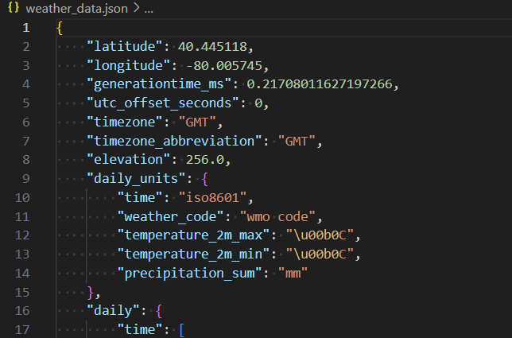
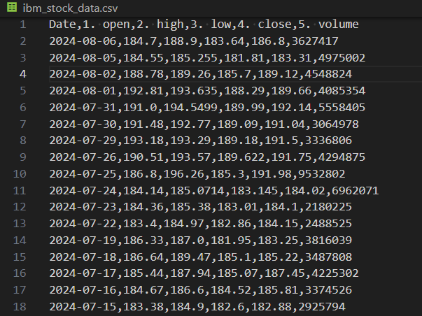

# Exercise: Data Collection

In this exercise, you will practice extracting data from two open-source APIs and saving it in different formats. You will use one API to fetch unstructured weather data and another API for structured IBM stock price data. This will help you handle various data formats and store data in a local file system.

## Exercise Overview

1. **Fetch and Save Unstructured Data from Weather API in JSON Format**
2. **Fetch and Save Structured Data from IBM Stock API in CSV Format**

## Tools and Libraries

- **Python 3.x**
- **Requests** library (for making API requests)
- **Pandas** library (for handling data and saving it as JSON and CSV)

## Step-by-Step Instructions

### 1. Fetch and Save Unstructured Data from Weather API in JSON Format

For unstructured data, we'll use [Open Meteo API](https://open-meteo.com/) to fetch weather data. No registration and no API key needed.

Create a Python script called `fetch_weather_data.ipynb` with the following content:

```python
# get packages
%pip install requests
import requests
import json

LATITUDE, LONGITUDE = 40.44, -79.99 # PITTSBURGH, PA
URL = f'https://api.open-meteo.com/v1/forecast?latitude={LATITUDE}&longitude={LONGITUDE}&daily=weather_code,temperature_2m_max,temperature_2m_min,precipitation_sum'

response = requests.get(URL)
data = response.json()

# Print the fetched data (optional)
print(json.dumps(data, indent=4))

# Save data to JSON file
with open('weather_data.json', 'w') as json_file:
    json.dump(data, json_file, indent=4)
```

You should now have a new json file with the following contents  
  

### 2. Fetch and Save Structured Data from IBM stock price in CSV Format

For structured data, we'll use [IBM Stock Demo Data](https://www.alphavantage.co/query?function=TIME_SERIES_DAILY&symbol=IBM&apikey=demo). No registration and no API key needed.

Create a Python script called `fetch_ibm_data.ipynb` with the following content:

``` python
%pip install requests
%pip install pandas
import requests
import pandas as pd

URL = 'https://www.alphavantage.co/query?function=TIME_SERIES_DAILY&symbol=IBM&apikey=demo'

response = requests.get(URL)
data = response.json()

# Extract the time series data
time_series_data = data["Time Series (Daily)"]

# Convert the time series data to a DataFrame
df = pd.DataFrame.from_dict(time_series_data, orient='index')

# Reset index to make the date a column
df.reset_index(inplace=True)
df.rename(columns={'index': 'Date'}, inplace=True)

# Convert data types as needed (e.g., to float)
df = df.astype({
    '1. open': 'float',
    '2. high': 'float',
    '3. low': 'float',
    '4. close': 'float',
    '5. volume': 'int'
})

df.to_csv('ibm_stock_data.csv', index=False)

display(df)
```

You should now have a new csv file with the following contents  


---

In this exercise, you have learned how to:  
- Fetch unstructured data from the OpenWeatherMap API and save it as a JSON file.
- Fetch structured data from the IBM Stock Data API and save it as a CSV file.

[<<< Previous Section: Data Collection](2.%20Data%20Collection.md)    [Next Section: Data Transformation and Processing >>>](3.%20Data%20Transformation%20and%20Processing.md)
