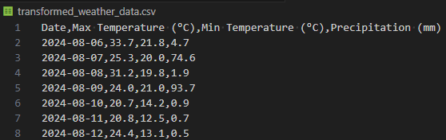
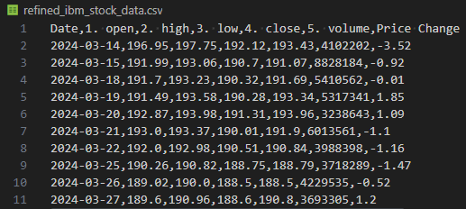

# Exercise: Data Transformation and Processing

In this exercise, you will learn how to clean, transform, and process the data you collected from the APIs. You will handle both unstructured weather data in JSON format and structured IBM stock price data in CSV format. The goal is to ensure the data is in a usable state for analysis.

## Exercise Overview

1. Clean and transform the weather data.
2. Process and refine the stock price data.

## Tools and Libraries

- **Python 3.x**
- **Pandas** library (for data manipulation and cleaning)
- **Numpy** library (optional, for additional data handling capabilities)

## Step-by-Step Instructions

### 1. Transform and Process Weather Data

We'll start by transforming the unstructured JSON weather data into a more structured and analysis-friendly format.

Create a Python script called `transform_weather_data.ipynb`:

```python
%pip install pandas
import json
import pandas as pd

# Load the weather data from the JSON file
with open('weather_data.json') as json_file:
    weather_data = json.load(json_file)

# Extract daily forecast data
daily_data = weather_data['daily']
dates = weather_data['daily']['time']
max_temps = weather_data['daily']['temperature_2m_max']
min_temps = weather_data['daily']['temperature_2m_min']
precipitation = weather_data['daily']['precipitation_sum']

# Create a DataFrame to store the extracted data
df_weather = pd.DataFrame({
    'Date': dates,
    'Max Temperature (°C)': max_temps,
    'Min Temperature (°C)': min_temps,
    'Precipitation (mm)': precipitation
})

# Convert Date column to datetime format
df_weather['Date'] = pd.to_datetime(df_weather['Date'])

# Optional: Handle missing values, if any
df_weather.fillna(0, inplace=True)

# Save the transformed data to a new CSV file
df_weather.to_csv('transformed_weather_data.csv', index=False)

# Display the DataFrame
display(df_weather)
```

You should now have a new csv file with the following contents  
  

### 2. Process and Refine IBM Stock Price Data

Next, we will clean and transform the structured stock price data.

Create a Python script called `process_ibm_data.ipynb`:

```python
%pip install pandas
import pandas as pd

# Load the IBM stock data from the CSV file
df_ibm = pd.read_csv('ibm_stock_data.csv')

# Convert Date column to datetime format
df_ibm['Date'] = pd.to_datetime(df_ibm['Date'])

# Sort data by Date for better analysis
df_ibm.sort_values(by='Date', ascending=True, inplace=True)

# Optional: Add new features, such as daily price change
df_ibm['Price Change'] = df_ibm['4. close'] - df_ibm['1. open']

# Handle any missing or erroneous data
df_ibm.fillna(method='ffill', inplace=True)  # Forward fill missing data

# Round the price columns to two decimal places
price_columns = ['1. open', '2. high', '3. low', '4. close', 'Price Change']
df_ibm[price_columns] = df_ibm[price_columns].round(2)

# Reset the index
df_ibm.reset_index(drop=True, inplace=True)

# Save the refined stock data to a new CSV file
df_ibm.to_csv('refined_ibm_stock_data.csv', index=False)

# Display the DataFrame
display(df_ibm)
```

You should now have a new csv file with the following contents  


### Summary

In this exercise, you have learned how to:
- Transform unstructured weather data into a structured format.
- Refine and clean stock price data, creating new features for analysis.
- Handle missing values and ensure data consistency.

---

[<<< Previous Section: Data Transformation and Processing](2.%20Data%20Transformation%20and%20Processing.md)    [Next Section: Data Analysis and Exploration >>>](4.%20Data%20Analysis%20and%20Exploration.md)
