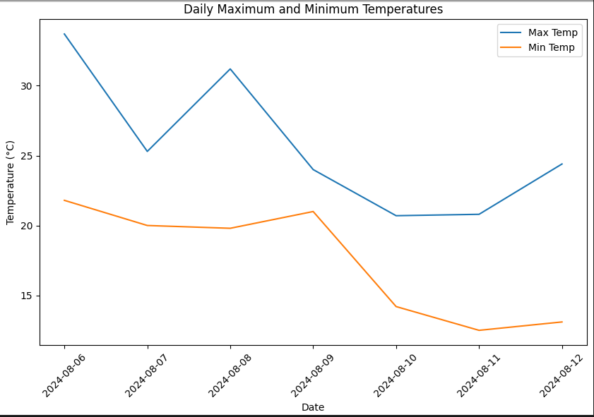

# Exercise: Data Analysis and Exploration

In this exercise, you will analyze the weather data and IBM stock data you previously collected. By performing descriptive analysis and creating visualizations, you will gain insights into trends and patterns in the data.

## Exercise Overview

1. Analyze Weather Data (Descriptive Statistics and Visualization)
2. Analyze IBM Stock Data (Descriptive Statistics, Visualizations, and Correlations)

## Tools and Libraries

- **Python 3.x**
- **Pandas** (for data manipulation)
- **Matplotlib** (for creating visualizations)
- **Seaborn** (for enhanced visualizations)

## Step-by-Step Instructions

### 1. Analyze Weather Data

Create a new Python script called `analyze_weather_data.ipynb` and use the following steps to analyze the weather data:

```python
%pip install pandas
%pip install matplotlib
%pip install seaborn
import pandas as pd
import matplotlib.pyplot as plt
import seaborn as sns

# Load the transformed weather data from the CSV file
df_weather = pd.read_csv('transformed_weather_data.csv')

# Convert Date column to datetime format
df_weather['Date'] = pd.to_datetime(df_weather['Date'])

# Descriptive statistics
print(df_weather.describe())

# Plot maximum and minimum temperatures over time
plt.figure(figsize=(10, 6))
sns.lineplot(data=df_weather, x='Date', y='Max Temperature (°C)', label='Max Temp')
sns.lineplot(data=df_weather, x='Date', y='Min Temperature (°C)', label='Min Temp')
plt.title('Daily Maximum and Minimum Temperatures')
plt.xlabel('Date')
plt.ylabel('Temperature (°C)')
plt.xticks(rotation=45)
plt.legend()
plt.show()

# Plot precipitation over time
plt.figure(figsize=(10, 6))
sns.barplot(data=df_weather, x='Date', y='Precipitation (mm)', color='skyblue')
plt.title('Daily Precipitation')
plt.xlabel('Date')
plt.ylabel('Precipitation (mm)')
plt.xticks(rotation=45)
plt.show()

```

By running the above code, you will calculate summary statistics for the weather data and visualize temperature trends over time.




### 2. Analyze IBM Stock Data

Create another Python script called `analyze_ibm_stock.ipynb` and follow the steps below to analyze the IBM stock data:

```python
%pip install pandas
%pip install matplotlib
%pip install seaborn
import pandas as pd
import matplotlib.pyplot as plt
import seaborn as sns
import matplotlib.dates as mdates

# Load the IBM stock data from the refined CSV file
df_ibm = pd.read_csv('refined_ibm_stock_data.csv')

# Convert Date column to datetime format
df_ibm['Date'] = pd.to_datetime(df_ibm['Date'])

# Descriptive statistics
print(df_ibm.describe())

# Plot closing prices over time with better spaced date ticks
plt.figure(figsize=(10, 6))
sns.lineplot(data=df_ibm, x='Date', y='4. close', label='Closing Price')
plt.title('IBM Daily Closing Prices')
plt.xlabel('Date')
plt.ylabel('Price (USD)')

# Set date format and spacing for x-axis ticks
plt.gca().xaxis.set_major_locator(mdates.WeekdayLocator(interval=2))  # Adjust the interval
plt.gca().xaxis.set_major_formatter(mdates.DateFormatter('%Y-%m-%d'))
plt.xticks(rotation=45)
plt.legend()
plt.show()
```

This code will display summary statistics for IBM stock data, visualize the daily closing prices, and explore the correlation between price changes and trading volume.


### Summary

In this exercise, you performed basic descriptive analysis and visualized the weather and stock data to uncover trends and relationships. You have now gained experience in using key data analysis techniques that can be applied to different datasets.

## Conclusion

Congratulations on completing this data engineering tutorial! Throughout this journey, you’ve gained hands-on experience with key stages in the data pipeline: data collection, transformation, processing, and analysis. You’ve learned how to extract both structured and unstructured data from APIs, perform data cleaning and transformation, and explore insights through statistical methods and visualizations.

These foundational skills will help you tackle real-world data challenges, enabling you to work efficiently with various data sources, ensure data quality, and uncover actionable insights. As you continue your data engineering journey, remember that these processes are iterative—each stage informs the next, improving your ability to deliver meaningful data solutions.

I hope you found this tutorial both informative and practical. Keep experimenting, refining your workflows, and expanding your knowledge to master the art of data engineering.

---

[<<< Previous Section: Data Analysis and Exploration](4.%20Data%20Analysis%20and%20Exploration.md)